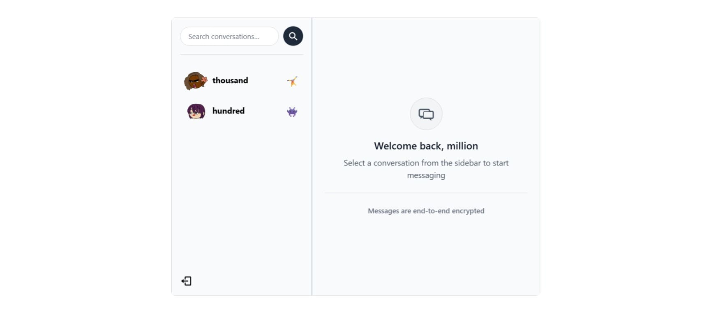
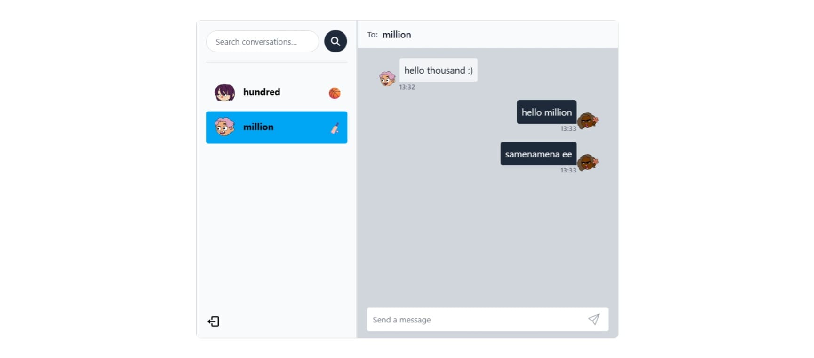

# MERN REALTIME CHAT APP

## Table of Contents
- [Overview](#overview)
- [Features](#features)
- [Dependencies](#dependencies)
- [Quick Start](#quick-start)
- [Configuration](#configuration)

## Overview
A real-time chat application enabling seamless one-on-one conversations with a clean, intuitive interface. This full-stack web application provides instant messaging capabilities with real-time message delivery, user authentication, and a user-friendly sidebar interface for easy navigation between conversations.

**Core Concept:** Connect with individuals through private, real-time messaging in a minimalist and efficient chat environment.

<p align="center">   </p> <p align="center"> <em>Real-time chat interface and user discovery features</em> </p>

## Features

- **User Authentication**: Secure signup, login, and logout functionality with JWT-based sessions
- **Real-time Messaging**: Instant message delivery using WebSocket technology for live conversations
- **User Discovery**: Search functionality to find and connect with other users
- **Conversation Management**: One-on-one chat interface with conversation history
- **Sidebar Interface**: Clean sidebar displaying all available users for easy conversation switching
- **Responsive Design**: Modern UI that works across different device sizes

## Dependencies

### Backend
- **Express.js** - Node.js web application framework
- **Socket.io** - Real-time bidirectional event-based communication
- **MongoDB** with **Mongoose** - NoSQL database and ODM
- **JSON Web Tokens (JWT)** - Secure authentication and authorization
- **bcrypt** - Password hashing for security
- **cors** - Cross-Origin Resource Sharing middleware

### Frontend
- **React** - Frontend library for building user interfaces
- **Socket.io-client** - Client-side WebSocket implementation
- **React Router** - Client-side routing
- **Vite** - Frontend build tool and development server

## Quick Start

### Prerequisites
- Node.js (v16 or higher)
- MongoDB installed and running locally or accessible via cloud service
- npm or yarn package manager

### Installation and Setup

1. **Clone and navigate to the project**
   ```bash
   git clone <repository-url>
   cd chat-app
   ```

2. **Backend Setup**
   ```bash
   cd backend
   npm install
   npm run server
   ```

3. **Frontend Setup** (in a new terminal)
   ```bash
   cd frontend
   npm install
   npm run dev
   ```

4. **Access the application**
   - Backend server will run on the configured PORT (default: 5000)
   - Frontend development server will run (typically on port 5173)
   - Open your browser and navigate to `http://localhost:5173`

## Configuration

### Backend Environment Variables
Create a `.env` file in the `backend` directory with the following variables:

```env
# Server Configuration
PORT=5000

# Database Configuration
MONGO_DB_URI=mongodb://localhost:27017/chat-app

# Security Configuration
JWT_SECRET=your_super_secret_jwt_key_here_change_this
```

### Frontend Environment Variables
Create a `.env` file in the `frontend` directory with:

```env
# Socket.io Server URL
VITE_SOCKET_URL=http://localhost:5000
```

For production deployment, update these URLs to point to your production server.

---

**Developed by muhammadderic**  
[My GitHub Profile](https://github.com/muhammadderic)